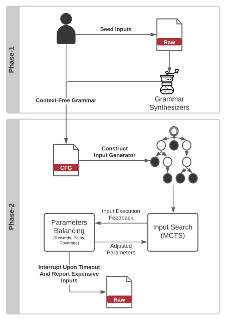

# TreeLine


Finding slow input faster using Monte-Carlo Tree Search and application provided context-free grammar. 

Given some target application and grammar on how to generate inputs for it, _TreeLine_ will generate
high-level inputs that exercise the target application's worst-execution case. _TreeLine_ allows you to
specify the maximum length of the desired sample inputs (test cases). It also uses the grammar
provided to build a derivation tree that is sampled following the Monte-Carlo Tree Search technique.

## Related Publication(s):


## How _TreeLine_ Works:

The seed for _TreeLine_ is a context-free grammar.
You can either use a grammar sensitizers from seed inputs or provide grammar from the target application documentation.

The second phase is fully automated.
The algorithm will annotate the provided grammar with a cost for each production-rule.
The cost will be driving the derivation options based on the maximum budget you specified.
Derivations are represented as search tree.
This is the same tree used for balancing the search using MCTS. 
The algorithm will then go on generating inputs, collecting feedback, balancing the search in each iteration until the time is up.
There are many parameters we are balancing in each iteration such as the reward, the coverage, the path in the search tree. 
If the search stall according to different parameters, the algorithm might even drop the search tree and starts with new one for faster and more effective results.

By the end of the search the algorithm will have generated many inputs one of which is maximizing the execution cost.



## Usage:

- Build the Docker image:

  The back end instrumented execution of an application must take 
  place in a Docker container. This must be built once, like the
  command given below.Note that it will take a long time as we
  build AFL and each target application.
  ```shell
  docker build -t treeline-img:latest .
  ```

- Run a new container

  After it has been built, it can be started in Docker, like this
  ```shell
  docker run -p 2300:2300 --name treeline -it treeline-img /bin/bash
  ```
  This publishes port `2300`, which can then be reached either within 
  the Docker container or from the host machine (e.g., from an 
  Intel-based Mac laptop for testing). But before we can test input 
  generation for a particular application, we need an instrumented 
  version of that application running under the test harness in the 
  Docker container. For example, to experiment with an instrumented 
  version of GraphViz, we need to build and run the instrumented 
  version of GraphViz. We take care if this for the sample target
  applications. However, to see an example, the build process is
  described within shell script for each established target application
  ([this is the GraphViz build script](target_apps/graphviz/build.sh)).
  
- Run the AFL listener for a target application:

  Using the commands provided as sample on each target application
  README file([wf](target_apps/word-frequency/README.md), [libxml](target_apps/libxml2/README.md),
  [lunasvg](target_apps/lunasvg/README.md), [graphviz](target_apps/graphviz/README.md),
  [flex](target_apps/flex/README.md)), run the AFL listener for that target app.
  This is an example of running the AFL listener for GraphViz 
  ```shell
  afl-socket -i /home/treeline/target_apps/graphviz/inputs/ -o /home/results/graphviz-001 -p -N 500 -d dot
  ```

- Run _TreeLine_'s algorithm 
  
  To run the search process you have two options.
  - **Option 1**: Run from your local machine
    
    Run [treeline.py](src/treeline.py) with the configuration you want (see [defaults.yaml](src/defaults.yaml))
    form your local machine. This means that you are
    responsible for all python's dependencies. 
    ```shell
    python3 treeline.py 
    ```
  - **Option 2**: Use the same container to run the [treeline.py](src/treeline.py)
    
    Open another bash screen on the same container you have up and running.
    ```shell
    docker exec -it treeline /bin/bash
    ```
    Then navigate to `/home/treeline/src` and run [treeline.py](src/treeline.py)
    as you would on your local machine with the configurations you define (see [defaults.yaml](src/defaults.yaml)). 
    ```shell
    python3 treeline.py
    ```

## Example Outputs:

A 5 seconds run on GraphViz, could generate something similar to directory list in the sample below
(default `/tmp/treeline/<experiment-id>`).
Note we removed some of the generated inputs here for brevity. 


```shell
.
|-- bias.txt
|-- buffer
|   |-- id:000001,cost:0000039867,hs:0000001806,hnb:True,exec:1,len:060,tu:060,crtime:1684231302232,dur:11+cov+max+cost
|   |-- id:000002,cost:0000046411,hs:0000001806,hnb:True,exec:2,len:009,tu:009,crtime:1684231302236,dur:15+cov+max+cost
|   |-- id:000003,cost:0000049363,hs:0000001806,hnb:True,exec:3,len:013,tu:013,crtime:1684231302240,dur:19+cov+max+cost
|   |-- id:000004,cost:0000046975,hs:0000001806,hnb:True,exec:4,len:018,tu:018,crtime:1684231302244,dur:23+cov+max
|   |-- id:000005,cost:0000082306,hs:0000001806,hnb:True,exec:5,len:054,tu:054,crtime:1684231302253,dur:32+cov+max+cost
|   |-- id:000006,cost:0000047016,hs:0000001806,hnb:True,exec:6,len:011,tu:011,crtime:1684231302256,dur:35+cov
|   |-- id:000007,cost:0000052284,hs:0000001806,hnb:True,exec:9,len:023,tu:023,crtime:1684231302268,dur:47+cov+max
|   |-- ...
|   |-- id:000022,cost:0000124854,hs:0000001806,hnb:True,exec:48,len:060,tu:060,crtime:1684231302445,dur:224+cov+max+cost
|   |-- id:000023,cost:0000045617,hs:0000001806,hnb:True,exec:57,len:060,tu:060,crtime:1684231302481,dur:260+cov+max
|   |-- id:000024,cost:0000037191,hs:0000001806,hnb:True,exec:58,len:025,tu:025,crtime:1684231302485,dur:264+cov
|   |-- ...
|   |-- id:000106,cost:0000610195,hs:0000008496,hnb:True,exec:374,len:060,tu:060,crtime:1684231304377,dur:2156+cov+max+cost
|   |-- ...
|   |-- id:000197,cost:0000355591,hs:0000005130,hnb:True,exec:784,len:060,tu:060,crtime:1684231307180,dur:4959+cov+max
|   `-- id:000198,cost:0000097834,hs:0000001806,hnb:True,exec:788,len:024,tu:024,crtime:1684231307208,dur:4987+cov
|-- config-and-stats-report.txt
|-- configurations.yaml
|-- gram-with-cost.txt
|-- progress-report.csv
|-- traces.log
`-- trees
    `-- 01-TreeVis.dot
```

The output can be described as the following:
- **bias.txt**: The biasing values the algorithm finished with based on the given grammar and target application.
- **buffer/**: Is the directory where all the generated inputs are saved. For each input we track a set of data that we
    use for naming it. Note we only save interesting inputs (+cov, +max, +cost).
  - `id`: The input sequence.
  - `cost`: The total number of edge hits that the input exercised.
  - `hs` (hot-spot): the count of edge hits for the edge that was hit the most. 
  - `hnb` (has-new-bits): Did the input exercised a new coverage?
  - `exec`: The number of execution from the beginning of the run until the generation of this input. 
  - `len`: The length of inputs in bytes.
  - `tu` (tokens-used): The number of tokens used. This can be different from `len` if we define the cost using some measurement other than bytes (e.g., chars).
  - `crtime`: Creation time of the input. 
  - `dur` (duration): The time it toke to generate the given input since the beginning of th run in milliseconds.
  - `+cov`: The input exercised some new coverage.
  - `+max`: The input exercised some new hotspot. 
  - `+cost`: The input exercised some new cost.
- **config-and-stats-report.txt**: Some statistics about the run as well as the configurations used. 
- **configurations.yaml**: The exact configurations used for running this experiment in case we want to regenerate it. 
- **gram-with-cost.txt**: The grammar used with annotations the highlight the calculated costs of each production-rule.
- **progress-report.csv**: A detailed report of the hyperparameters values (and other measurements) as the search progressed.
- **traces.log**: Logs!
- **trees/**: An attempt to provide a visualisation of each MCTS tree that was established using dot language.

You clearly can find the most expensive input by sorting the input based on `cost` or find the last input that
exercised a `+cost`. In the case of the five seconds run there would not be enough time to find an actual expensive
input. Nevertheless, below we show the content of the input named
`id:000106,cost:0000610195,hs:0000008496,hnb:True,exec:374,len:060,tu:060,crtime:1684231304377,dur:2156+cov+max+cost`. 


## Dependencies:

All the dependencies are managed by the docker file provided. However, a major requirements for building and running
_Treeline_ is to build it on x86 processor. This is required for AFL's instrumentation to work. 

