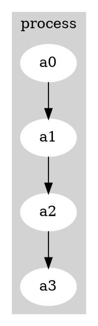

# [Graphviz](https://graphviz.org/)

We obtain the latest version at the time of our test (2.47.0).
The source file is provided here for reference under the [src](./src) directory.
However, if you wish to download the source file yourself, you can try this 
[download link](https://gitlab.com/graphviz/graphviz/-/package_files/8183714/download).

## Application Stats

```bash
$ cloc --not-match-f=test .
    3888 text files.
    3458 unique files.                                          
    2484 files ignored.

github.com/AlDanial/cloc v 1.70  T=23.44 s (60.3 files/s, 58793.0 lines/s)
---------------------------------------------------------------------------------------
Language                             files          blank        comment           code
---------------------------------------------------------------------------------------
C                                      564          27232          24514        1021021
make                                   249          10004           4982         105521
Bourne Shell                            36           8635           8066          50275
Bourne Again Shell                      29           4137           6449          22763
C/C++ Header                           341           4751           5616          22512
m4                                      19           1795            476          15650
C++                                     34           1198            998           7163
yacc                                     6            472            173           3365
XML                                      5            181             61           2469
Tcl/Tk                                  15            151            156           2188
HTML                                    20            192              0           1963
C#                                      20            300            443           1904
Markdown                                 1             94              0           1275
Visual Basic                             9            249            444           1003
Objective C                             12            221            153            955
Qt                                       2              0              0            940
MSBuild script                           4              0              7            729
JSON                                     1              0              0            422
Perl                                     6             74            132            421
XSLT                                     1             73             14            380
Windows Module Definition                3              5              0            368
lex                                      2             51             61            334
DOS Batch                                3             34             59            262
Python                                   8             43             19            214
Korn Shell                               2             25              0            209
awk                                     10             10             59            204
PowerShell                               3             28             11            136
WiX source                               1             12             10            106
Windows Resource File                    1             20             23             51
Ruby                                     2             12              4             38
INI                                      1              6              0             31
PHP                                      1              7              2             29
Lua                                      1             10              3             28
Qt Project                               1              4              0             16
---------------------------------------------------------------------------------------
SUM:                                  1413          60026          52935        1264945
---------------------------------------------------------------------------------------
```

We only count code of C, C++, and C/C++ Headers (given *test* files are excluded).
Thus, 1,021,021 + 22,512 + 7,163 = 1,050,696 SLoC.

## Manually Build the Source Code

After decompressing the file `tar -xf graphviz-2.47.0.tar.gz`, and within the new directory,
use AFL's compiler to generate the appropriate Makefile.

1. ```bash
   CXX=/home/git/perffuzz/afl-clang-fast++ CC=/home/git/perffuzz/afl-clang-fast ./configure
   ```

2. ```bash
   make
   ```

3. ```bash
   make install
   ```

All the necessary libraries should be now copied to the used environment with instrumented executables.

## Sample Run Without Fuzzing

To test the that the installation was successfully completed. You can run `dot` based on 
[sample graph](inputs/seed1.dot) (shown below) by simply passing the file to dot `dot sample.dot`.



The output should be something as the following:


To render the graph you could try the following: 

```bash
dot -Tps sample.dot -o sample.ps
```

## Run With AFL

To manually run the AFL listener on the target application you use a command similar to the one below.

```bash
afl-socket -i /home/treeline/target_apps/graphviz/inputs/ -o /home/results/graphviz-001 -p -N 500 -d dot
```
